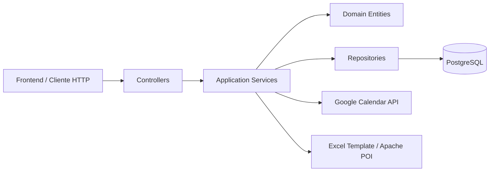

# Dashboard Afazio

Backend de `dashboard-afazio`, una aplicación para consolidar clases, consultoras, cursos, tarifas, ingresos y exportación Excel a partir de Google Calendar.

El sistema está pensado para operar con dos fuentes de autenticación:
- `Basic Auth` para la API interna `/api/**`
- `OAuth2 Google` para los flujos de calendario `/google/**`

## Resumen del proyecto

El backend cubre estos flujos principales:

- sincronización de eventos desde Google Calendar
- clasificación de clases por consultora y curso
- gestión de consultoras y cursos
- tarifas por consultora
- cálculo de ingresos mensuales
- exportación de reportes Excel
- marcación de asistencia y estado de clases

La unidad persistente de negocio es el `curso`. La clase es la ocurrencia concreta que llega desde el calendario y puede quedar clasificada o no.

## Arquitectura

El proyecto sigue una arquitectura por capas con separación clara entre API, aplicación, dominio e infraestructura.



### Capas

- `api`: controllers y DTOs de entrada/salida
- `application`: casos de uso, reglas de negocio, sincronización y cálculo
- `domain`: entidades JPA y enums del modelo
- `infrastructure`: repositorios Spring Data y adaptadores
- `shared`: seguridad, CORS, manejo global de errores y base común

### Módulos funcionales

- `core`: clases, consultoras, cursos y asistencia
- `calendar`: sincronización real con Google Calendar y provider local de desarrollo
- `billing`: tarifas e ingresos
- `reporting`: exportación Excel
- `shared`: cross-cutting concerns

## Stack tecnológico

- Java 21
- Spring Boot 4.0.3
- Spring Web MVC
- Spring Data JPA
- Spring Security
- Spring OAuth2 Client
- Flyway
- PostgreSQL
- Apache POI para Excel
- Actuator para health checks

## Decisiones técnicas

- Se usa JPA con `ddl-auto=none` y Flyway como única fuente de migraciones.
- Las credenciales de desarrollo son simples y locales: `admin / admin123`.
- El calendario real de Google se sincroniza con `app.google.calendar-id`.
- El campo `meetingUrl` se normaliza en backend para que el frontend no tenga que parsear descripciones.
- Las clases importadas sin asignación real se guardan como `Sin clasificar`.
- La clasificación persistente se hace sobre `cursoId`; la consultora queda asociada al curso.
- El ingreso mensual se calcula sobre clases `DICTADA`.
- Excel se genera a partir de una plantilla embebida en `src/main/resources/templates/excel/hg-horas-template.xlsx`.
- La consultora `Accenture` se usó como dato de prueba y hoy debe ser desactivada o removida del catálogo real.

## Modelo de datos

### Consultora

Representa la empresa/cliente que factura o consume las clases.

Campos principales:
- `id`
- `nombre`
- `descripcion`
- `activa`
- `requiereReporteExcel`
- `googleCalendarId`

### Curso

Representa el curso o grupo reusable dentro de una consultora.

Campos principales:
- `id`
- `consultoraId`
- `empresa`
- `grupo`
- `activa`

### Clase

Representa una ocurrencia concreta del calendario.

Campos principales:
- `id`
- `consultoraId`
- `cursoId`
- `titulo`
- `descripcion`
- `meetingUrl`
- `fechaInicio`
- `fechaFin`
- `duracionMinutos`
- `googleEventId`
- `estado`
- `empresa`
- `grupo`
- `facturable`
- `clasificacionConfirmada`

### TarifaConsultora

Guarda el valor hora por consultora y su vigencia.

Campos principales:
- `consultoraId`
- `montoPorHora`
- `moneda`
- `vigenteDesde`
- `vigenteHasta`
- `fechaUltimoAumento`
- `observaciones`

## Flujos principales

### Sincronización de Google Calendar

- `GET /google/calendar/sync?from=...&to=...`
- requiere sesión OAuth activa en Google
- importa eventos desde el calendario configurado
- limpia eventos ignorados
- evita duplicados con `googleEventId`
- mantiene la clasificación previa cuando hay coincidencia por serie o título

### Clasificación

- `PUT /api/clases/{id}/clasificacion`
- `PUT /api/clases/{id}/clasificacion/mismo-titulo`

La clasificación puede hacerse:
- con un `cursoId`
- o manualmente con `consultoraId`, `empresa` y `grupo`

### Ingresos

- `GET /api/ingresos?from=...&to=...`
- opcionalmente filtra por `consultoraId` y `cursoId`
- solo considera clases `DICTADA`
- solo considera clases `facturable = true`

### Excel

- `GET /api/reportes/excel?consultoraId=...&periodo=YYYY-MM`
- genera un archivo `.xlsx` a partir de la plantilla
- usa las clases dictadas y la tarifa vigente

## API principal

### Clases

- `GET /api/clases/hoy?fecha=YYYY-MM-DD`
- `GET /api/clases/semana?desde=YYYY-MM-DD&soloClasificadas=true|false`
- `GET /api/clases?from=YYYY-MM-DD&to=YYYY-MM-DD&soloClasificadas=true|false`
- `GET /api/clases/pendientes-clasificacion`
- `PUT /api/clases/{id}/clasificacion`
- `PUT /api/clases/{id}/clasificacion/mismo-titulo`
- `PUT /api/clases/{id}/estado`
- `PUT /api/clases/{id}/dictada`
- `DELETE /api/clases/purga`

### Consultoras

- `GET /api/consultoras`
- `POST /api/consultoras`
- `DELETE /api/consultoras/{id}` (desactivación lógica)

### Cursos

- `GET /api/cursos`
- `GET /api/cursos?consultoraId=...`
- `POST /api/cursos`
- `PUT /api/cursos/{id}`

### Tarifas

- `POST /api/tarifas`
- `PUT /api/tarifas/{id}`
- `GET /api/tarifas/consultoras/{consultoraId}`
- `GET /api/tarifas/vigente?consultoraId=...&fecha=YYYY-MM-DD`

### Asistencia

- `POST /api/asistencias`

## Estructura de recursos

- `src/main/resources/db/migration`: migraciones Flyway
- `src/main/resources/templates/excel/hg-horas-template.xlsx`: template Excel
- `src/main/resources/application.properties`: configuración base
- `src/main/resources/application-local.properties`: configuración local

## Ejecución local

### Requisitos

- Java 21
- Maven Wrapper
- PostgreSQL local

### Base de datos local

El perfil local apunta a:

- `jdbc:postgresql://localhost:5433/dashboard_afazio`
- usuario `postgres`
- password `postgres`

### Arranque

```bash
./mvnw spring-boot:run -Dspring-boot.run.profiles=local
```

### Health check

```bash
curl http://localhost:8080/actuator/health
```

## Docker

### Archivos clave

- `Dockerfile`: build multi-stage de la app
- `docker-compose.yml`: app + PostgreSQL + healthchecks
- `.env.example`: plantilla de variables de entorno

### Arranque con compose

```bash
cp .env.example .env
docker compose up --build
```

### Healthchecks

- `db` usa `pg_isready`
- `app` valida `GET /actuator/health`
- el `app` espera a que `db` esté saludable antes de arrancar

### Uso esperado en primera fase de producción

- exponer solo `8080` hacia el exterior
- mantener PostgreSQL persistente con volumen
- usar `.env` o variables de entorno del entorno de despliegue
- cargar credenciales reales de Google OAuth solo en ese entorno
- validar siempre `/actuator/health` antes de publicar tráfico

## Variables de entorno

- `APP_GOOGLE_CALENDAR_ID`: calendario compartido a sincronizar
- `APP_CORS_ALLOWED_ORIGINS`: orígenes permitidos por CORS

## Estándares técnicos

- No se usa `ddl-auto` para crear esquema en runtime.
- Las migraciones son incrementales y versionadas con Flyway.
- Las respuestas HTTP se modelan con DTOs explícitos.
- Los errores de negocio se devuelven con manejo global de excepciones.
- Las clases del calendario no se muestran como consultoras reales cuando no están confirmadas.
- El frontend no debe inferir datos de negocio parseando títulos o descripciones.
- Los valores persistentes para la clasificación deben salir de `cursoId`, no del texto visible.

## Notas de despliegue

- El perfil `docker` está pensado para contenedores y toma toda la configuración por variables de entorno.
- Flyway corre al arranque y valida el esquema antes de levantar la app.
- La app publica un healthcheck en `/actuator/health`.
- El sync de Google requiere que el entorno tenga credenciales OAuth reales y un redirect URI válido.
- El frontend no debería inferir datos de negocio parseando títulos o descripciones; eso queda en backend.

## Siguiente paso recomendado

Antes de pasar a producción, validá:

- `docker compose up --build`
- `curl http://localhost:8080/actuator/health`
- `curl -u admin:admin123 http://localhost:8080/api/consultoras`
- sync de Google con sesión OAuth real
- generación de Excel contra una consultora con clases dictadas y tarifas vigentes

Si querés, el próximo mensaje te lo convierto directamente en un plan de implementación de Docker, archivo por archivo.
